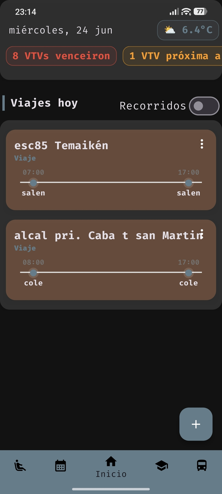
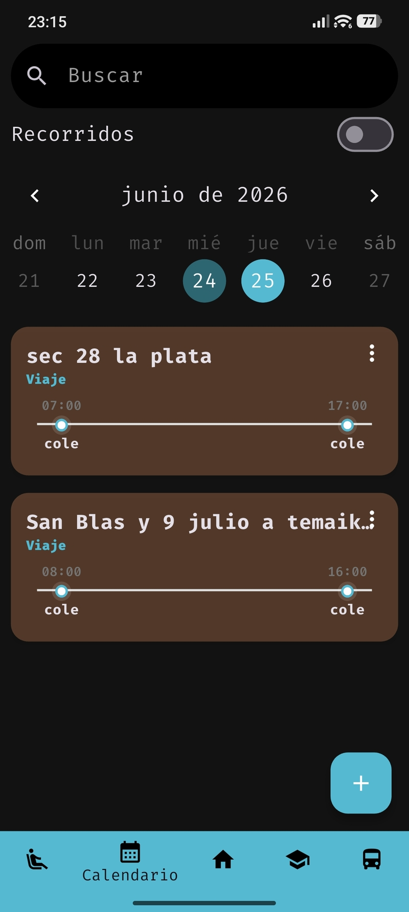
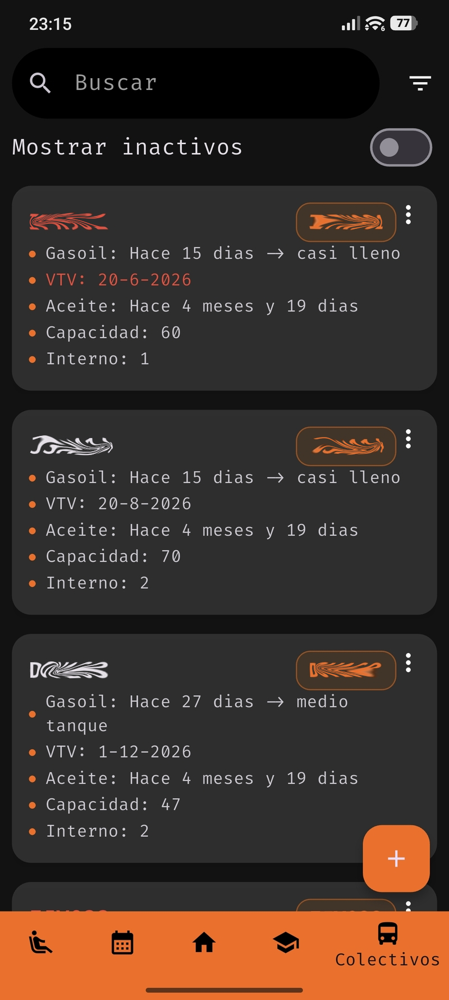
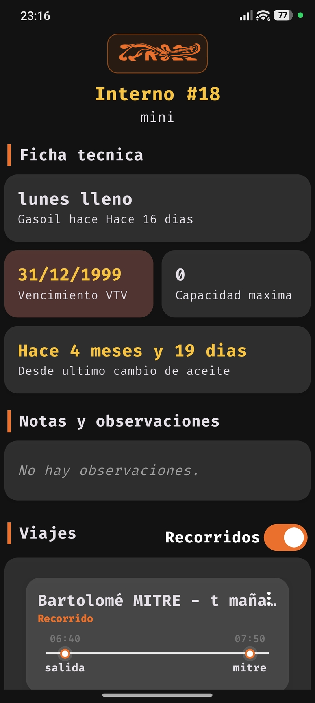
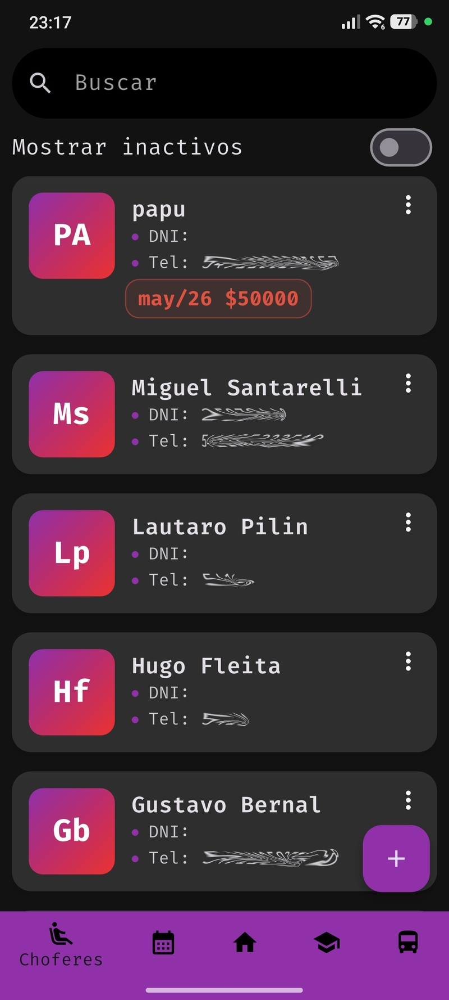
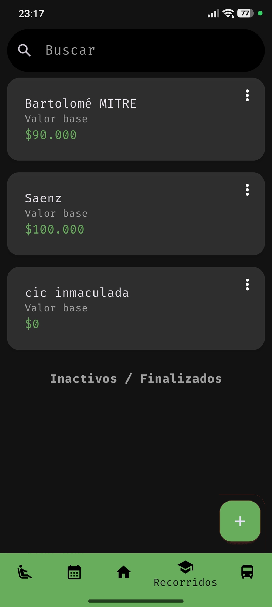
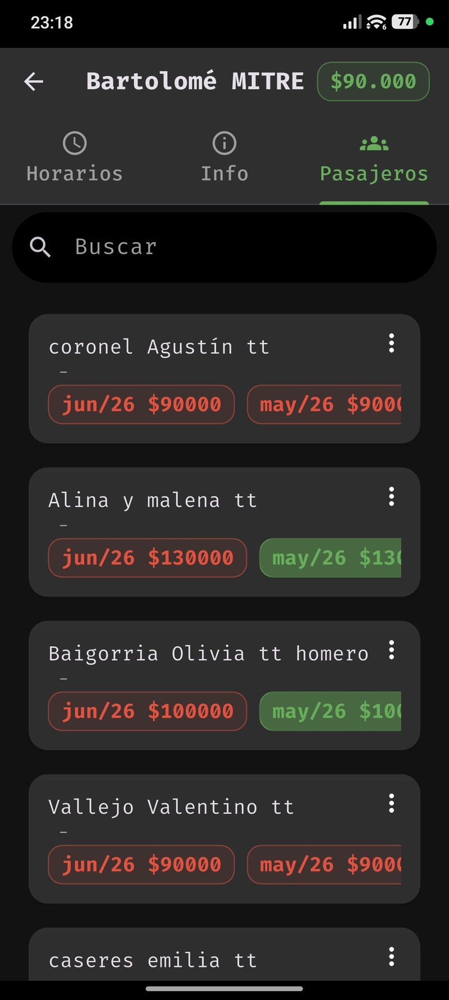
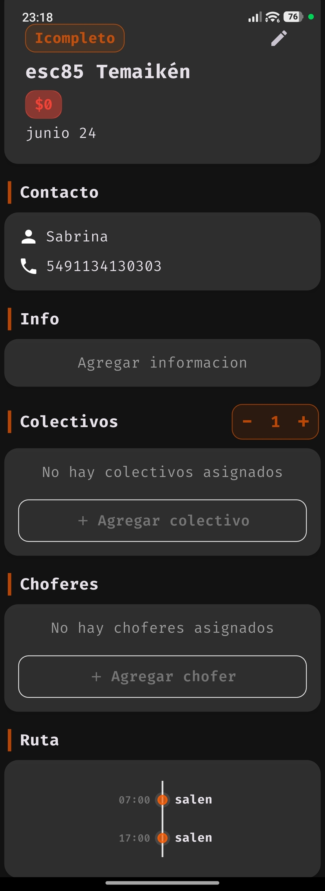

# Fleet Management System

A comprehensive, offline-first mobile application and backend API designed to manage a transport fleet, drivers, routes, daily events, and financial accounting.

## Repository Structure

This is a monorepo containing both the mobile client and the backend service:

* `/app`: Flutter mobile application.
* `/server`: Go REST API and PostgreSQL database.

## Key Features and Application Flow

### Dashboard and Planning

* **Home**: overview of daily operations and pending tasks.



* **Calendar**: Daily and monthly view of all assigned trips, shifts, and recurrent school routes.



### Fleet and Personnel

* **Buses**: Fleet registry, capacity tracking, and maintenance alerts (VTV, oil changes, fuel levels).

| coelcivos | colectivoInfo |
| ---- | -------- |
|  |  |


* **Drivers**: Personnel management, availability, and active debt/balance tracking.



### Logistics and Operations

* **Routes**: Pre-defined routes, base pricing, and assigned passengers tracking.

| recorridos | recorridoInfo |
| ---- | -------- |
|  |  |

* **Event Management**: Specific trip information, including assigned driver, bus, and scheduled stops.



### System and Offline Sync

* **Settings & Debug**: App configuration, manual synchronization triggers, local SQLite database backup, and developer debug tools.

## Technical Stack

**Frontend (Mobile)**

* Framework: Flutter
* Local Database: Drift (SQLite)
* State Management: Provider
* Architecture: Offline-first. The app relies on a local database for all read/write operations and synchronizes with the server in the background using a custom push/pull mechanism with transactional JSON payloads.

**Backend (API)**

* Language: Go
* Database: PostgreSQL
* Architecture: REST API handling bulk sync requests, resolving conflicts, and managing relational integrity.

## Local Development Setup

### Backend (Go)

1. Setup a local PostgreSQL instance.
2. Configure your environment variables (Database credentials, API keys).
3. Start the server:
```bash
go run main.go

```


### Frontend (Flutter)

1. Ensure you have the required environment variables passed during the build (DOMAIN, API_KEY).
2. Generate the Drift database files:
```bash
dart run build_runner build --delete-conflicting-outputs

```


3. Run the application:
```bash
flutter run

```
